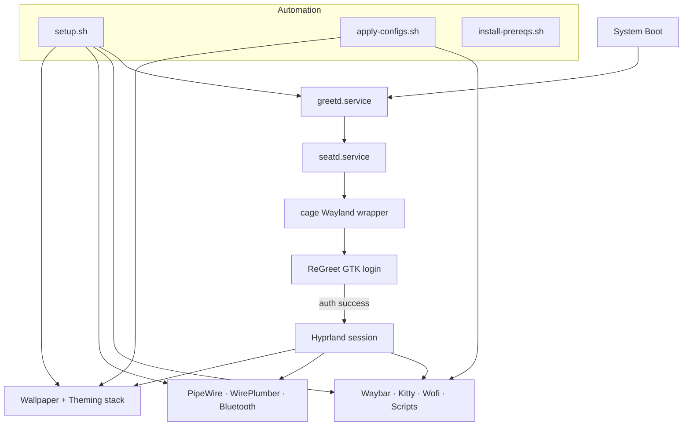

# Arch Linux Hyprland Setup

This directory contains a complete Arch Linux setup extracted from your NixOS configuration, designed to replicate your neo-brutalist Hyprland environment on Arch Linux.

## Quick Start

1. **Run the setup script** (as a regular user, not root):
   ```bash
   cd arch-hyprland-setup
   chmod +x setup.sh
   ./setup.sh
   ```

   Or, if you already have packages installed and only want to apply the design configs:
   ```bash
   chmod +x apply-configs.sh
   ./apply-configs.sh
   ```

   Need the minimal prerequisites only (for apply-configs.sh)?
   ```bash
   chmod +x install-prereqs.sh
   ./install-prereqs.sh
   ```

2. **Reboot and log in via ReGreet** (greetd will present the login screen automatically)

3. **Enjoy your neo-brutalist Hyprland setup!**

## Architecture Overview



Prerequisites for apply-configs.sh only:
- Hyprland, waybar, wofi, kitty, mako, swww, wl-clipboard, cliphist, grim, slurp, pipewire(+wireplumber) installed
- Fonts: JetBrains Mono Nerd, Noto Emoji (or equivalents)

## Sync From NixOS (optional)

If you are on your NixOS machine and want to regenerate the Arch configs from your live Home‑Manager setup:

```bash
cd arch-hyprland-setup
chmod +x sync-from-nixos.sh
./sync-from-nixos.sh
```

Details:
- Copies rendered configs from ~/.config (resolving symlinks) for: hypr, waybar, kitty, starship, yazi, mako, wofi, scripts
- Updates bashrc from repo (home-manager/config/bashrc)
- Syncs wallpapers from home-manager/wallpapers into arch-hyprland-setup/wallpapers
- Review and commit diffs after syncing

## What's Included

### Core Components
- **Hyprland**: Wayland compositor with your exact configuration
- **Kitty**: Terminal with 8 neo-brutalist color themes
- **Waybar**: Status bar with neo-brutalist styling
- **Starship**: Shell prompt with custom neo-brutalist theme
- **Yazi**: File manager with custom theme and keybindings
- **Mako**: Notification daemon with neo-brutalist styling

### Additional Tools
- **Wofi**: Application launcher
- **Swww**: Wallpaper daemon
- **Hyprlock/Hypridle**: Screen locking and idle management
- **All your development tools**: Git, Docker, Python, Node.js, Rust, etc.
- **Media tools**: MPV, ImageMagick, FFmpeg
- **System monitoring**: btop, htop, fastfetch
- **Login experience**: greetd + regreet configured with a neo-brutalist theme
- **Shell greeter**: `~/.config/scripts/welcome.sh` runs on each new terminal session with quick tips

### Features Replicated
- ✅ All keybindings from your NixOS setup
- ✅ Workspace auto-assignment for applications
- ✅ Multi-monitor support
- ✅ Screenshot functionality
- ✅ Clipboard history
- ✅ Theme switching for Kitty and VS Code
- ✅ Custom scripts and aliases
- ✅ Neo-brutalist color scheme throughout
- ✅ USB-C storage auto-mounts to /mnt/usb{n} based on the physical port

## Meeting Note Capture

- **`configs/scripts/meeting-notes.sh`**: Desktop helper that transcribes an existing audio file with WhisperX and drops the Markdown notes next to the source recording. Dependencies install automatically on first run.
- **Android app (`android/recording-transcription/`)**: Minimal Compose UI for capturing on-device audio (`rec-<timestamp>.m4a`) and optional transcripts (`<name>-transcript.txt`) stored together inside the app's recordings directory. Ideal for capturing meetings on the go and syncing the files back into your workstation workflow.

## Directory Structure

```
arch-hyprland-setup/
├── setup.sh                 # Main installation script
├── configs/                 # All configuration files
│   ├── hypr/               # Hyprland configuration
│   ├── kitty/              # Kitty terminal configuration
│   ├── waybar/             # Waybar configuration
│   ├── starship/           # Starship prompt configuration
│   ├── yazi/               # Yazi file manager configuration
│   ├── mako/               # Mako notification configuration
│   ├── wofi/               # Wofi launcher configuration
│   └── scripts/            # Custom scripts
├── wallpapers/             # Wallpaper files
├── packages/               # Package lists
│   ├── aur-packages.txt    # AUR packages to install
│   └── pacman-packages.txt # Official repo packages
├── android/recording-transcription/
│   ├── app/                # Android Studio module (Compose UI, recorder, ViewModel)
│   └── README.md           # Mobile app usage notes
└── docs/                   # Documentation
    ├── keybindings.md      # Keyboard shortcuts reference
    └── troubleshooting.md  # Common issues and solutions
```

## Manual Installation Steps

If you prefer to install manually or the script fails:

1. **Install packages**:
   ```bash
   # Install official packages (includes greetd, regreet, seatd, and cage)
   sudo pacman -S --needed $(cat packages/pacman-packages.txt)

   # Install AUR helper (yay)
   git clone https://aur.archlinux.org/yay.git
   cd yay && makepkg -si

   # Install AUR packages
   yay -S --needed $(cat packages/aur-packages.txt)
   ```

2. **Copy configurations and assets**:
   ```bash
   mkdir -p ~/.config ~/.local/share ~/.local/bin ~/Pictures/{wallpapers,screenshots}
   cp -r configs/* ~/.config/
   chmod +x ~/.config/scripts/*
   cp wallpapers/* ~/Pictures/wallpapers/
   ```

3. **Configure bash** (optional but recommended):
   ```bash
   cp ~/.bashrc ~/.bashrc.backup 2>/dev/null || true
   cat >~/.bashrc <<'EOF'
if [ -f ~/.config/bash/bashrc ]; then
    source ~/.config/bash/bashrc
fi

if command -v starship >/dev/null 2>&1; then
    export STARSHIP_CONFIG=~/.config/starship/starship.toml
    eval "$(starship init bash)"
fi
EOF
   ```

4. **Set up greetd + regreet manually** (from the repo root):
   ```bash
   sudo bash scripts/setup/configure-regreet.sh "$USER"
   ```

5. **Reboot and log in via ReGreet** to start Hyprland.

## USB-C Automount Configuration

Plugging a USB mass-storage device into any USB-C port now mounts it automatically to `/mnt/usb{n}`, where `n` matches the physical port number derived from the system's USB topology. Key files installed by `setup.sh`:

- Helper script: `/usr/local/lib/arch-hyprland/usb-automount.sh`
- Config: `/etc/arch-hyprland/usb-automount.conf`
- Udev rule: `/etc/udev/rules.d/99-arch-hyprland-usb-automount.rules`

You can tweak the mount root, name prefix, owning user/group, and default mount options by editing the config file and reloading the udev rule:

```bash
sudoedit /etc/arch-hyprland/usb-automount.conf
sudo udevadm control --reload
```

After plugging in a device, verify the selected port and mount point through the journal:

```bash
journalctl -t arch-usb-automount -n 20
```

Unmounting happens automatically on device removal. If a mount stays behind (e.g., device yanked mid-write), unmount manually with `sudo umount /mnt/usb{n}` before reconnecting.
